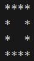
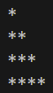
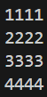
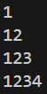
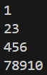
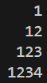
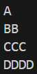

# PATTERNS IN C LANGUAGE 

**NOTE :**  Click on image to see code 
## PATTERN WITH STAR
 

 

 

 

 

 

 

 ## PATTERN WITH NUMBERS

 

 

 

 

 

 

## PATTERN WITH ALPHABETS
 

 

 

 
 
 

 

 

 

 

 

## PATTERN WITH COMBINATION OF ALPHABETS AND NUMBERS
 